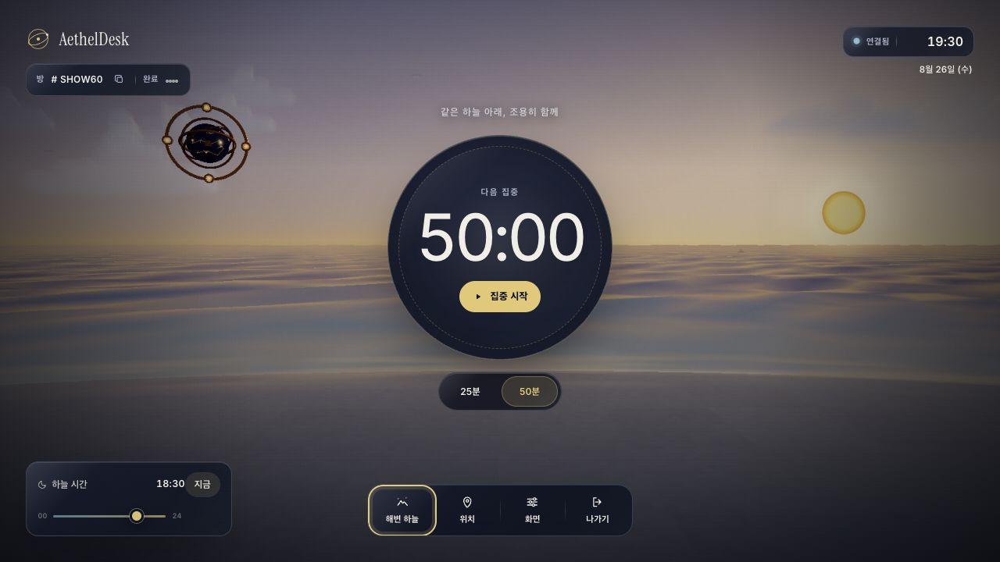
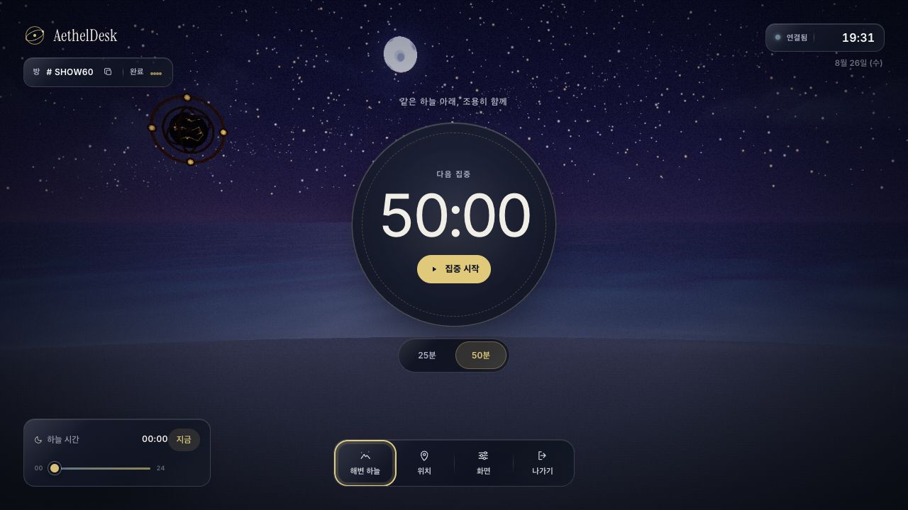
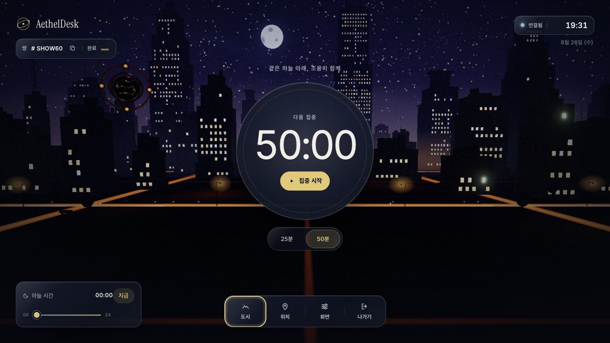
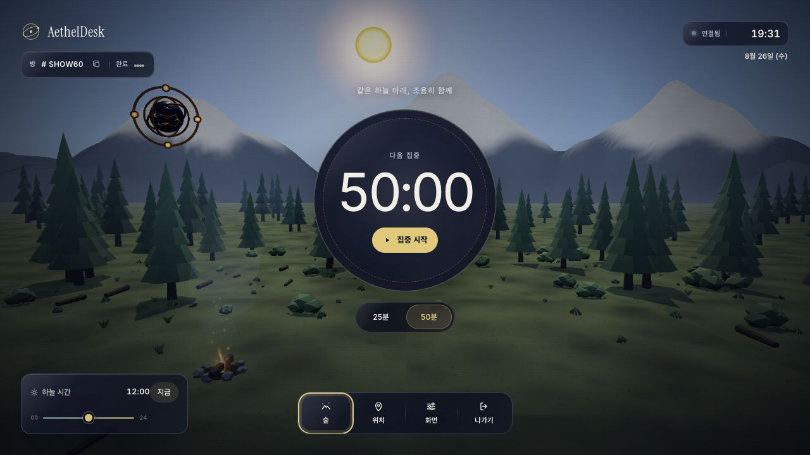
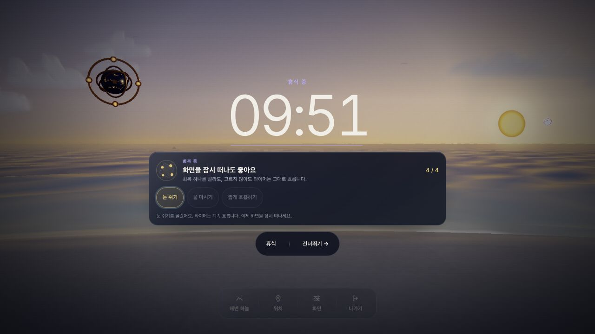

# AethelDesk

> A quiet celestial focus room built around a complete 50+10 rhythm.

<p align="center">
  
  
  
  
  
</p>

AethelDesk is a shared celestial dashboard for synchronized 50-minute focus sessions and fixed 10-minute recovery. Run it on your Mac, open the same PIN-protected room on your iPad, and keep the timer, sky, and completion ritual in sync.

<p align="center">
  
</p>

## Visual Tour

The same 50+10 focus room moves naturally through the day and across three distinct environments while keeping the timer and shared controls consistent.

| Moonlit coast | City after dark | Alpine forest |
|---|---|---|
|  |  |  |

## A Complete Return

Every normal completion moves immediately into the same ten-minute recovery ritual. The code-only Three.js **Aethel Astrarium** lights one of four amber nodes, persists across scene changes and reconnects, and never replays its reveal from a restored snapshot.

<p align="center">
  
</p>

## Architecture

AethelDesk keeps room coordination server owned while the browser client stays lightweight:

* Frontend: Vite + vanilla ES modules with a shared Three.js renderer. `package.json` and `package-lock.json` are the authoritative frontend dependency files.
* Backend: FastAPI serves `/`, `/room/{room_id}`, REST room APIs, WebSockets, `/health`, Vite hashed assets at `/assets/*` when `frontend/dist/assets` exists, and source frontend files as a no-cache fallback.
* Static cache policy: route-owned HTML uses `Cache-Control: no-cache`, Vite hashed `/assets/*` uses `public, max-age=31536000, immutable`, and root static fallback uses `no-cache`.
* Room state: Redis stores the canonical JSON room state and metadata with keys such as `aetheldesk:room:{ROOM_ID}:state` and `aetheldesk:room:{ROOM_ID}:meta`.
* Sync: Redis Pub/Sub publishes full-state room snapshots on `aetheldesk:room:{ROOM_ID}:events`; each worker fans updates out only to its own local WebSockets.
* Scheduler: every worker may run the scheduler, but Redis `TIME` leases and state revisions fence each timer commit. A running focus or break keeps advancing through a temporary browser disconnect without double-decrementing.
* Access: rooms use a PIN at create or join time. Atomic standalone-Redis operations serialize room creation, bind opaque token hashes to one room generation, and never store plaintext PINs.

Redis state is restart-tolerant ephemeral room state when Docker AOF is enabled with `appendfsync everysec`. It can recover current active room state after a restart, but it is not permanent history, audit storage, analytics storage, or replay storage.

See [`docs/architecture/contracts.md`](docs/architecture/contracts.md) for the route, WebSocket, Redis, state, and frontend storage contracts that later work must preserve.

## What It Does

| Feature | Details |
|---|---|
| Celestial ambience | Backend calculates the sun state and broadcasts updates to connected clients. |
| Shared rooms | `/room/{room_id}` serves the Vite room page for the same shared session. |
| Room PIN access | Create and join flows require a PIN and return an opaque session token. |
| 50+10 focus cycle | Starts at 50 minutes by default and follows every normal completion with the same fixed 10-minute break. |
| Completion ritual | A monotonic reward lights one Aethel Astrarium node, then offers optional recovery and next-intent choices without stopping the shared timer. |
| Three environments | Switch between the unified coastal sky, city, and forest; the retired standalone beach preference migrates to the coast. |
| Touch-friendly controls | During focus and recovery, surrounding controls recede gently and return to full contrast on pointer or keyboard interaction. |
| Korean-primary UI | Interactive copy and status text use Korean-first wording while keeping `AethelDesk`, `PIN`, storage keys, and API fields stable. |

## Command Matrix

Run commands from the repository root unless a row says otherwise.

| Command | Use | Expected gate |
|---|---|---|
| `uv sync --frozen` | Install locked Python runtime and dev dependencies from `pyproject.toml` and `uv.lock`. | Required for local dev and CI before Python gates. |
| `uv run ruff format --check .` | Check Python formatting policy. | CI formatting gate. |
| `uv run ruff check .` | Run Python lint checks. | CI lint gate. |
| `uv run pyright` | Run Python type checks. | CI type gate. |
| `uv run pytest -q` | Run the default non-e2e Python suite. | Required local and CI test gate. |
| `uv run playwright install chromium` | Install the Chromium browser for Playwright if missing. | Setup step for browser e2e. |
| `uv run pytest tests/e2e -m e2e --browser chromium -q` | Run Playwright browser e2e. | CI e2e gate and local regression gate for user-visible flows. |
| `npm ci` | Install locked frontend dependencies from `package-lock.json`. | Docker frontend build stage and clean frontend setup. |
| `npm run dev` | Start the Vite dev server on `0.0.0.0`. | Local frontend dev with backend proxy. |
| `npm run test:frontend` | Run atmosphere, scene-manager, storage, reward, rest-ritual, and fallback unit tests. | Required frontend behavior gate. |
| `npm run build` | Build production Vite assets into `frontend/dist`. | Required local and CI frontend gate. |
| `docker compose up --build --detach` | Build and start the app plus Redis. | Docker self-host setup and CI Compose health gate where Docker exists. |
| `docker compose ps` | Check Compose service health. | App and Redis should be healthy after startup. |
| `curl -fsS http://127.0.0.1:${APP_PORT:-8000}/health` | Check app health. | Returns success when Redis is required and reachable. |
| `docker compose exec redis redis-cli CONFIG GET appendonly appendfsync` | Confirm Redis AOF policy. | Reports `appendonly yes` and `appendfsync everysec`. |

If this host does not have `docker`, do not treat local Compose health as passed. CI still runs `docker compose up --build --detach` and `/health` in the Playwright e2e job.

## Local Setup

Install the locked Python environment:

```bash
uv sync --frozen
```

Run the backend locally without Docker:

```bash
AETHELDESK_ENV=test uv run uvicorn backend.main:app --host 0.0.0.0 --port 8000
```

Open the app from each device:

```text
http://<your-mac-ip>:8000
http://<your-mac-ip>:8000/room/<room-id>
```

`AETHELDESK_ENV=test` uses the test/local path and avoids requiring a production secret while you work locally. Outside pytest or test mode, set a real `AETHELDESK_SECRET_KEY` before starting the app.

## Frontend Development

Install frontend dependencies from the lockfile:

```bash
npm ci
```

Start Vite:

```bash
npm run dev
```

The Vite dev server uses `vite.config.js` with `root: "frontend"`. It proxies `/api` to `http://127.0.0.1:8000` and `/ws` to `ws://127.0.0.1:8000`, including WebSocket upgrade support for `/ws`. Start the FastAPI backend on port `8000` before using API or room sync through Vite.

Build production assets with:

```bash
npm run build
```

`npm run build` first compiles the local Tailwind stylesheet (`npm run build:css` → `frontend/tailwind.css`) and then runs Vite. The build writes to `frontend/dist`. FastAPI serves hashed assets from `frontend/dist/assets` when present. Do not commit generated `frontend/dist` unless a release process explicitly asks for it.

The frontend is fully self-contained: Tailwind is compiled locally and the Inter/Instrument Serif fonts are self-hosted under `frontend/fonts/` (via `frontend/fonts.css`). The current focus room has no YouTube, playlist, scene-audio, or third-party runtime request, so it can run on a private LAN with its FastAPI and Redis server.

## Docker Self-Host Setup

Docker Compose runs the FastAPI app and Redis:

```bash
cp .env.example .env
```

Edit `.env` and replace `AETHELDESK_SECRET_KEY=replace-with-long-random-secret` with a real secret, then start the stack:

```bash
docker compose up --build --detach
```

Check app health and Redis AOF configuration:

```bash
docker compose ps
curl -fsS http://127.0.0.1:${APP_PORT:-8000}/health
docker compose exec redis redis-cli CONFIG GET appendonly appendfsync
```

The Docker image builds frontend assets with `npm ci`, runs the final Python app as a non-root `appuser`, persists Redis in the `redis-data` volume, and checks Redis health with `PING`, `appendonly yes`, and `appendfsync everysec`. Redis config lives in `docker/redis/redis.conf`.

Required and useful environment variables:

| Variable | Default | Purpose |
|---|---|---|
| `APP_PORT` | `8000` | Host port used by Docker Compose. |
| `REDIS_URL` | `redis://redis:6379/0` | Redis connection URL for the app container. |
| `ROOM_TTL_SECONDS` | `300` | Disconnected idle/paused room expiry window; connected or advancing rooms refresh it. |
| `ROOM_TICK_LOCK_SECONDS` | `2` | Redis lease-marker TTL for fenced per-room scheduler ticks. |
| `AETHELDESK_ENV` | `docker` in `.env.example` | Runtime mode. Use `test` only for local/test runs. |
| `AETHELDESK_SECRET_KEY` | none | Required outside pytest/test mode for Room PIN tokens. |
| `AETHELDESK_TRUST_PROXY` | off | Set to `1` only behind a trusted reverse proxy so `X-Forwarded-For` is used for PIN rate-limit identity. Leave off when the app is exposed directly. |

## Dependency Files And Generated Files

| File | Status |
|---|---|
| `pyproject.toml` | Authoritative Python project metadata, runtime dependencies, dev group, Ruff config, and Pyright config. |
| `uv.lock` | Authoritative locked Python dependency graph. |
| `requirements.txt` | Exported compatibility file for Docker image installation. Keep it aligned with `pyproject.toml`, but do not treat it as the source of truth. |
| `requirements-dev.txt` | Exported compatibility file for older local scripts. Keep it aligned when Python dev dependencies change, but do not treat it as authoritative. |
| `package.json` | Authoritative frontend scripts, Three.js runtime dependency, and Vite/Tailwind development dependencies. |
| `package-lock.json` | Authoritative locked frontend dependency graph. |
| `frontend/dist/` | Generated Vite production output. Build with `npm run build`; do not edit by hand. |
| `.omo/evidence/` | Local task evidence artifacts. Append evidence during delegated tasks, but do not commit these files unless the orchestrator says to. |

## CI Gates And QA Evidence

CI and local release checks should cover these gates:

1. `uv sync --frozen`
2. `uv run ruff format --check .`
3. `uv run ruff check .`
4. `uv run pyright`
5. `uv run pytest -q`
6. `uv run playwright install chromium`
7. `uv run pytest tests/e2e -m e2e --browser chromium -q`
8. `npm ci`
9. `npm run test:frontend`
10. `npm run build`
11. Docker Compose build, app health, and Redis AOF health where Docker is installed

For delegated tasks, save concise command output or summaries under `.omo/evidence/task-{N}-{slug}.txt`. When a gate cannot run because the host lacks a tool, record the exact blocker and do not mark the gate as passed.

## Governance For Modernization

AethelDesk is now a Vite + vanilla ES module frontend with a FastAPI backend. React, Vue, Svelte, TypeScript, Webpack, SQL/accounts/analytics, Redis Streams, Celery, Kubernetes, TLS automation, and reverse-proxy config remain out of scope unless separately approved.

Redis remains mandatory outside explicit test mode and for all cross-worker behavior. The in-memory path is restricted to pytest or `AETHELDESK_ENV=test`.

Korean-primary copy is the UI policy. Interactive controls, validation errors, live regions, and connection or location status should use Korean-first wording. Keep the brand name `AethelDesk`, the security acronym `PIN`, storage keys, API fields, and route names stable. See [`docs/ux/audit.md`](docs/ux/audit.md) for the current UX contract and historical audit.

External frontend dependency policy:

* The current room intentionally ships without music, playlists, or scene ambient audio. A later first-party audio experience needs its own approved state and storage contract.
* Frontend runtime assets stay local and are bundled through Vite.
* Inter and Instrument Serif remain self-hosted under `frontend/fonts/`.

Still out of scope for this modernization:

* OAuth, user accounts, profiles, invite systems, admin dashboards, or analytics.
* SQL history, PostgreSQL or Postgres storage, permanent audit logs, or permanent room history.
* Redis Streams replay, Celery, CRDTs, distributed queues, or event replay storage.
* Kubernetes, managed cloud automation, TLS automation, Nginx, Traefik, or reverse-proxy config changes.

## Room PIN Behavior

Create and join both require a PIN of 4-64 characters. Room ids are restricted to `[A-Z0-9]` after normalization, so they cannot inject extra Redis key segments. On success, the frontend stores the opaque token in `sessionStorage` under `room_token:{ROOM_ID}` and uses it on the room WebSocket URL. Tokens are scoped to the verified room generation; recreating the same room id invalidates older credentials. Each room admits at most 256 live session tokens and returns HTTP `429` instead of evicting an existing session at the limit.

Plaintext PIN values are sent only with the create or join request. They are not stored in Redis, room state, WebSocket payloads, `sessionStorage`, or `localStorage` after the request completes. Authentication failures use generic responses, including the Korean room error `입장할 수 없습니다`, so the UI does not reveal whether a room exists.

## Tests And E2E

Default Python tests exclude browser E2E through `pytest.ini`:

```bash
uv run pytest -q
```

Install Chromium for Playwright, then run the browser suite:

```bash
uv run playwright install chromium
uv run pytest tests/e2e -m e2e --browser chromium -q
```

Run the frontend production build gate:

```bash
npm run build
```

## Reverse Proxy WebSocket Notes

Reverse-proxy config changes are out of scope for this modernization. If you place AethelDesk behind an existing trusted reverse proxy, preserve WebSocket upgrades for `/ws/*`:

* Forward `Upgrade` and `Connection` headers.
* Preserve `Host` and overwrite `X-Forwarded-For` with the real client IP.
* Disable response buffering on WebSocket paths.
* Keep WebSocket timeouts long enough for focus sessions.
* Set `AETHELDESK_TRUST_PROXY=1` only when the proxy is trusted and overwrites the header.

Without these settings, room sync can fail or disconnect unexpectedly.

## Controls

| Control | Behavior |
|---|---|
| Time slider | Drag to override sun position; double-click to return to real time. |
| Focus button | Starts the shared focus countdown; 25/50-minute chips choose the duration without starting it. |
| Timer controls | Pause, resume, cancel, or skip the fixed 10-minute break; none of these actions mints an extra reward. |
| Rest ritual | Optional recovery and next-intent choices guide the break without changing the authoritative timer. |
| Scene picker | Switches among the unified coastal sky, city, and forest. |
| Focus-session UI | Surrounding controls dim during focus or recovery and return to full contrast when hovered or keyboard-focused. |

## Troubleshooting

| Symptom | Check |
|---|---|
| `npm run dev` loads the page but API calls fail | Start FastAPI on `127.0.0.1:8000`; Vite proxies `/api` to that backend. |
| Room sync fails through Vite dev server | Confirm the backend is on port `8000` and the Vite `/ws` proxy is active. Browser WebSockets should connect through `/ws/{ROOM_ID}?token=...`. |
| Built pages load without JS | Run `npm run build`, confirm `frontend/dist/assets` exists, and restart FastAPI or Docker so the new assets are served. |
| `/assets/*` returns 404 in production | The Vite build output is missing from `frontend/dist`; rebuild locally or check the Docker frontend build stage. |
| `/health` returns 503 or rooms cannot sync | Redis is unavailable. Check the Redis container, `REDIS_URL`, and `docker compose ps`. |
| Redis health never becomes healthy in Compose | Check `docker/redis/redis.conf` and `docker compose exec redis redis-cli CONFIG GET appendonly appendfsync`; expected values are `yes` and `everysec`. |
| Startup fails with missing `AETHELDESK_SECRET_KEY` | Set a real secret in `.env` for Docker or production. Only pytest/test mode can use the built-in test secret. |
| Playwright says Chromium is missing | Run `uv run playwright install chromium`. If the host warns about missing system libraries, install the OS packages named by Playwright. |
| `uv sync --frozen` fails | The lockfile is out of date or `uv.lock` does not match `pyproject.toml`. Update dependencies intentionally, then refresh the lockfile. |
| Docker commands fail with `docker: command not found` | Docker is not installed on this host. Record the blocker as evidence and do not claim Compose passed. |

## Development Notes

The app is intentionally small. The current stack is FastAPI, Redis, Vite, and vanilla ES modules:

```text
aetheldesk/
|-- backend/
|   |-- frontend_routes.py
|   |-- main.py
|   |-- redis_contract.py
|   |-- room_routes.py
|   |-- room_service.py
|   |-- room_store.py
|   |-- scheduler.py
|   |-- state.py
|   `-- websocket_handler.py
|-- frontend/
|   |-- app.js
|   |-- lobby.html
|   |-- lobby.js
|   |-- room.html
|   |-- scenes.js
|   `-- src/
|-- tests/
|   |-- e2e/
|   |-- test_backend_routes.py
|   |-- test_frontend_static.py
|   `-- test_websocket_redis.py
|-- docker/redis/redis.conf
|-- docker-compose.yml
|-- Dockerfile
|-- package.json
|-- package-lock.json
|-- pyproject.toml
`-- uv.lock
```

## Contributing

Contributions are welcome. To keep the project small and predictable:

1. Open an issue first for anything beyond a small fix, so scope can be agreed before code.
2. Fork, branch from `main`, and keep changes focused.
3. Match the approved scope: FastAPI, Redis, Vite, vanilla JavaScript, and no new heavyweight runtime dependencies without agreement.
4. Add or update tests for behavior changes and make sure the relevant suite passes.
5. Run the command matrix gates that match your change.
6. Open a pull request describing the change and how you verified it.

Please keep proposals within the project's intent. See [Governance For Modernization](#governance-for-modernization) before suggesting larger systems.

## License

Released under the [MIT License](LICENSE). You are free to use, modify, and distribute it, including for commercial purposes, provided the copyright and license notice are retained.
